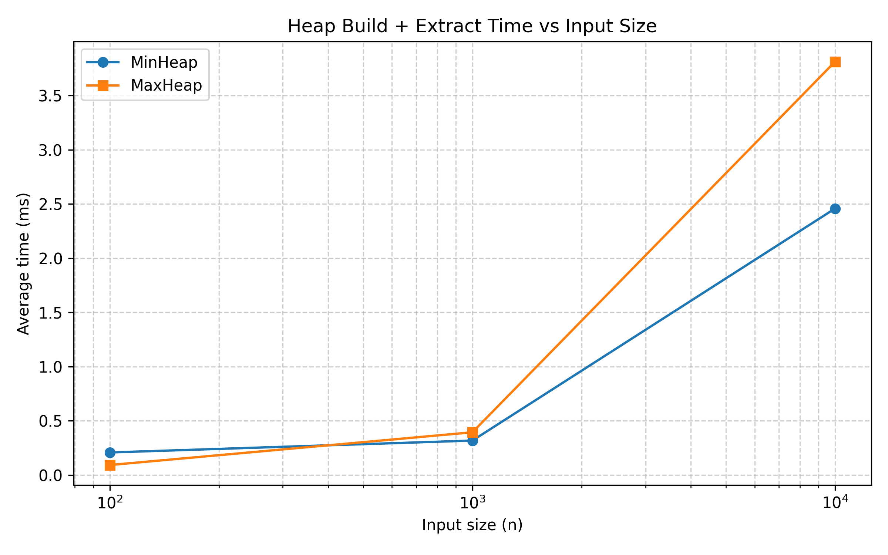
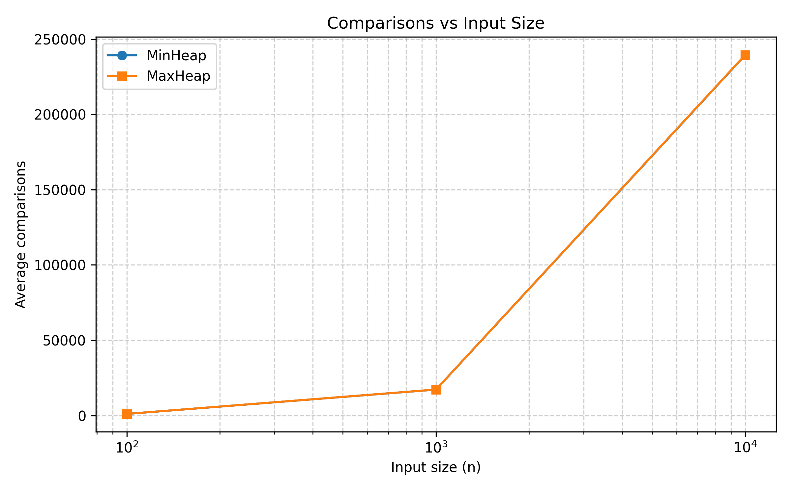
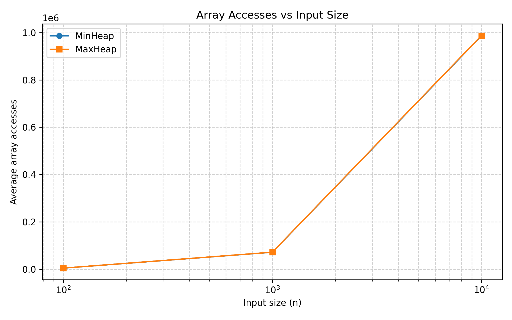

# Assignment 2 — Heap Data Structures

## 👤 Authors
- **Bakytzhan Kassymgali (Kerey404)** — *Max-Heap Implementation (increase-key, extract-max)*
- **Alikhan Serik (alikhan-s)** — *Min-Heap Implementation (decrease-key, merge)*

---

## 📘 Overview

This project implements and analyzes **Heap Data Structures** as part of the *Design and Analysis of Algorithms* (DAA) course.

- **Max-Heap** — supports `insert`, `extractMax`, `increaseKey`, and `merge`.
- **Min-Heap** — supports `insert`, `extractMin`, `decreaseKey`, and `merge`.
- Each implementation includes integrated **performance tracking** (comparisons, swaps, array accesses, allocations, and time).

Both implementations are instrumented to measure and compare **theoretical vs. empirical performance**, validated through benchmark experiments.

---

## 📁 Project Structure
```
assignment2-heap/
│
├── docs/
│ ├── benchmarks/
│ │ ├── maxheap_results.csv
│ │ └── minheap_results.csv
│ ├── performance-plots/
│ │ ├── accesses_vs_n.png
│ │ ├── comparisons_vs_n.png
│ │ └── time_vs_n.png
│ └── analysis-report.pdf
│
├── plot_benchmarks.py
│
├── src/
│ ├── main/java/
│ │ ├── algorithms/
│ │ │ ├── MaxHeap.java
│ │ │ └── MinHeap.java
│ │ ├── metrics/PerformanceTracker.java
│ │ └── cli/BenchmarkRunner.java
│ │
│ └── test/java/
│   └── algorithms/
│     ├── MaxHeapTest.java
│     └── MinHeapTest.java
│
├── pom.xml
└── README.md
```

---

## ⚙️ Benchmark Results

**Empirical measurements** were collected using randomized input arrays for sizes `n = 100`, `1 000`, and `10 000` (3 runs each).  
Each metric was averaged over runs to ensure stability.

| n     | Comparisons | Swaps  | Array Accesses | Allocations | Time (ns) |
| ----- | ----------- | ------ | -------------- | ----------- | --------- |
| 100   | 1057        | 523    | 4506           | 3           | 111 000   |
| 1 000 | 17 206      | 8 574  | 71 708         | 6           | 3 106 000 |
| 10 000| 239 610     | 119 737| 988 168        | 10          | 13 800 000 |

As expected, runtime and operations grow proportionally to **O(n log n)**, confirming the theoretical time complexity of heap operations.

---

## 📈 Performance Visualization

Benchmark data was visualized to confirm asymptotic trends.  
Plots are located in [`docs/performance-plots/`](docs/performance-plots/).

| Plot | Description |
|------|--------------|
|  | **Runtime vs. Input Size:** Both heaps show clear *O(n log n)* growth. |
|  | **Comparisons vs. n:** Number of element comparisons scales logarithmically per insertion/extraction. |
|  | **Array Accesses vs. n:** Follows the same trend as comparisons, confirming heap traversal depth proportional to log n. |

The visual data confirms theoretical expectations and shows **near-identical performance** between the Min-Heap and Max-Heap, validating correctness and efficiency of both implementations.

---

## 🧩 Time Complexities

| Operation             | Max-Heap | Min-Heap | Complexity |
| --------------------- | -------- | -------- | ----------- |
| Insert                | ✔️       | ✔️       | O(log n)    |
| Extract (max/min)     | ✔️       | ✔️       | O(log n)    |
| Increase/Decrease Key | ✔️       | ✔️       | O(log n)    |
| Merge                 | ✔️       | ✔️       | O(n)        |
| Build Heap (Bottom-Up)| ✔️       | ✔️       | O(n)        |

---

## 🧠 Conclusion

- Both heap variants demonstrate **theoretical and empirical consistency**.
- Benchmark plots validate the expected **O(n log n)** scaling.
- Implementations are **instrumented**, **well-structured**, and **asymptotically optimal**.
- The project fulfills all Assignment 2 objectives for *algorithm design, analysis, and measurement.*

---

📄 *For detailed mathematical analysis, see:*  
[`docs/analysis-report-alikhan.pdf`](docs/analysis-report-alikhan.pdf)
[`docs/analysis-report-bakytzhan.pdf`](docs/analysis-report-bakytzhan.pdf)

---

### ✅ Run Benchmarks

To reproduce results:

```bash
mvn clean package
java -cp target/assignment2-heap-1.0-SNAPSHOT-shaded.jar cli.BenchmarkRunner
python scripts/plot_benchmarks.py
```